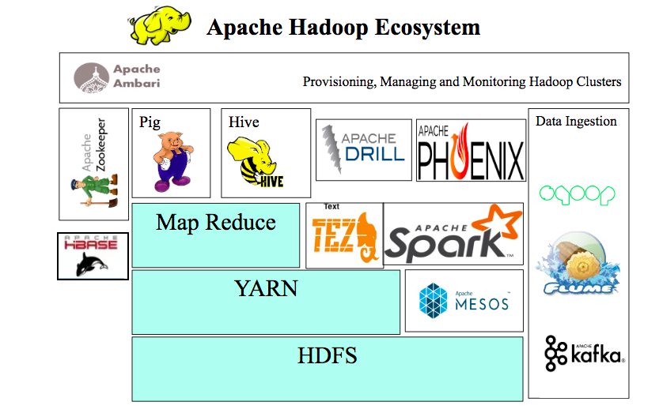

.. big_data:

========
Big Data
========

.. contents:: :local:

https://www.quora.com/What-is-a-Hadoop-ecosystem

.. _introduction:

Introduction
============
The tooling and methodologies to deal with the phenonmon of big data was originally created in response to the exponential growth in data generation (TODO: INSERT quote about data generation). 
When talking about big data we mean (insert what we mean). 

We'll be focusing exclusively on the Apache Hadoop Ecosystem, which is [insert something]. It contains many different libraries that help achieve different aims.

**Why It's Important:**

While a data scientist may not specifically be involved with the specifics of managing big data and performing Extract, Transform and Load tasks, they'll
likely be responsible for querying sources where this data is stored at a minimum. Ideally, a data scientist should be familar with how this data is stored, how to query it,
and how to transform it (e.g. Spark, Hadoop, Hive would be three key technologies to be familar with).

.. subj_1:

Subj_1
===========

.. rubric:: Code

Some code:
::

  print("hello")

.. rubric:: References

.. [1] https://www.example.com
